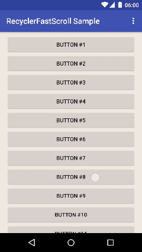

# Recycler Fast Scroll



Widget for `RecyclerView` fast scrolling, like Android's built-in fast scroll option for `ListView`.

Currently only supports verically-scrolling `LayoutManager`s.  
Planned features are listed at the [issues page](https://github.com/plusCubed/recycler-fast-scroll/issues).  
You can download the sample APK from the [releases page](https://github.com/plusCubed/recycler-fast-scroll/releases).

### Dependency
[](https://jitpack.io/#com.pluscubed/recycler-fast-scroll)  
Add the jitpack.io repo and this library to `build.gradle`:
```Gradle
repositories {
  // ...
  maven { url "https://jitpack.io" }
}

dependencies {
  // ...
  compile 'com.github.plusCubed:recycler-fast-scroll:{latest-version}'
}
```
The library is versioned according to [Semantic Versioning](http://semver.org/).

### Usage
1. Add the widget to your layout file, e.g.:
    ```xml
    <FrameLayout
        android:layout_width="match_parent"
        android:layout_height="match_parent">

        <android.support.v7.widget.RecyclerView
            android:layout_width="match_parent"
            android:layout_height="match_parent" />

        <com.pluscubed.recyclerfastscroll.RecyclerFastScroller
            android:layout_width="wrap_content"
            android:layout_height="match_parent"
            android:layout_gravity="end" />

    </FrameLayout>
    ```
    
2. Attach the `RecyclerFastScroller` to your `RecyclerView`:
    ```java
    fastScroller.setRecyclerView(recyclerView);
    ```

See the sample project for complete demos.

### Customization & methods
| Method | Attribute | Description |
| --- | --- | --- |
| `setBarColor(int color)`| `rfs_barColor` | Color of scrollbar. Defaults to `colorControlNormal` attribute. Alpha of ~22% is applied to the drawable to match stock `ListView` fast scroller. |
| `setHandleNormalColor(int color)` | `rfs_handleNormalColor` | Color of handle. Defaults to `colorControlNormal` attribute. |
| `setHandlePressedColor(int color)` | `rfs_handlePressedColor` | Color of pressed handle. Defaults to `colorAccent` attribute. |
| `setTouchTargetWidth(int width)` | `rfs_touchTargetWidth` | Width of the touch target. Defaults to 24dp (while the Android docs recommend at least 48dp, 24dp is more practical considering it will block touch in the right of the `RecyclerView`). |
|`setOnHandleTouchListener(OnTouchListener listener)`| -- | Sets listener for handle touch events. |

####Attribute Usage
```xml
<com.pluscubed.recyclerfastscroll.RecyclerFastScroller
    ...
    app:{attributeName}="{value}"/>
```


### License
```
Copyright 2015 Daniel Ciao

Licensed under the Apache License, Version 2.0 (the "License");
you may not use this file except in compliance with the License.
You may obtain a copy of the License at

   http://www.apache.org/licenses/LICENSE-2.0

Unless required by applicable law or agreed to in writing, software
distributed under the License is distributed on an "AS IS" BASIS,
WITHOUT WARRANTIES OR CONDITIONS OF ANY KIND, either express or implied.
See the License for the specific language governing permissions and
limitations under the License.
```

<br/>
<br/>
Mostly rewritten, but originally based off of [danoz73/RecyclerViewFastScroller](https://github.com/danoz73/RecyclerViewFastScroller).
